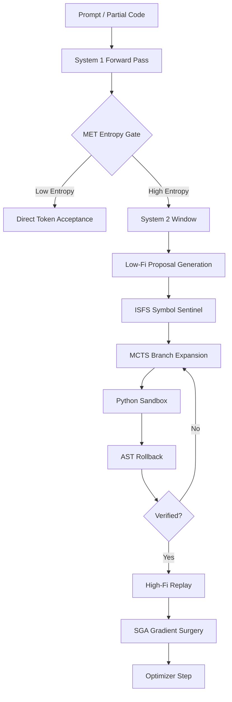

# Micro-CS

**Neuro-Symbolic Reasoning Engine for Consumer GPUs**  
*Democratizing High-Order Reasoning on 16 GB Hardware*

Micro-CS is an experimental research codebase that explores how far rigorous reasoning can be pushed on commodity hardware by combining a Mamba-style state-space backbone with symbolic execution, metacognitive routing, and selective high-fidelity learning.

Rather than treating language generation as unconstrained next-token imitation, Micro-CS treats reasoning as a staged control problem:

1. cheap low-fidelity search for breadth,
2. symbolic verification for correctness,
3. surgical rollback for fault localization,
4. selective high-fidelity backpropagation for durable learning.

## Abstract

Standard Transformer and MoE systems are exceptionally capable, but their deployment characteristics remain poorly matched to the consumer-GPU regime. The core issue is architectural: self-attention scales poorly with context length, KV cache growth creates a hard memory wall, and dense high-precision decoding wastes compute on branches that are obviously invalid only after full generation.

Micro-CS investigates a different operating point.

- A Mamba-2-style state-space backbone replaces the assumption that all history must remain explicitly materialized in memory.
- Monte Carlo Tree Search (MCTS) replaces single-shot decoding for difficult code and reasoning tasks.
- Symbolic guards intervene before and after execution, pruning invalid branches before they consume scarce high-fidelity budget.
- Gradient updates are focused near the actual error boundary instead of diffusing uniformly across already-correct logic.

The result is a research system designed to break the practical memory wall on 16 GB devices while preserving a path toward deeper, more deliberate reasoning.

## Why This Exists

Micro-CS is built around a simple thesis:

> If high-order reasoning is expensive, then the engine should spend full precision only where uncertainty and verification justify it.

That thesis leads to a dual-process architecture:

- **System 1**: low-cost sequential modeling and confidence-aware token generation.
- **System 2**: explicit search, sandbox validation, rollback analysis, and targeted correction.

## The 5 Pillars

### 1. LOD-Compute: Level-of-Detail Precision Routing

Micro-CS uses a graphics-inspired compute policy.

- During branch exploration, candidate paths are generated in **low-fidelity** mode using ternary 1.58-bit-style `BitLinear` routing.
- Once a branch is verified, the same path is replayed in **high-fidelity** FP16/BF16 mode for gradient quality.

This creates an explicit separation between search cost and learning quality.

\[
\text{Energy} \approx N_{\text{low-fi}} \cdot C_{\text{ternary}} + N_{\text{high-fi}} \cdot C_{\text{fp16}}
\]

When \(C_{\text{ternary}} \ll C_{\text{fp16}}\), the system can search broadly without paying full precision for every failed idea.

### 2. AST-Rollback: Syntax-Grounded Fault Localization

Instead of flattening all failed programs into a single negative reward, Micro-CS intercepts the traceback, maps the failure line back into the Python AST, and computes a rollback-aware reward.

\[
R_{\text{rollback}} =
\begin{cases}
100, & \text{if success} \\
0.5 \cdot (\ell - 1) - 50, & \text{if failure at line } \ell
\end{cases}
\]

This preserves credit for valid prefixes and penalizes only the poisoned span. In practice, that makes the search loop behave more like a debugger than a language model.

### 3. SGA: Surgical Gradient Attribution

Once rollback identifies the failure boundary, Micro-CS scales gradients asymmetrically:

- safe prefix tokens are down-weighted,
- failing-region tokens are amplified.

\[
g_i' =
\begin{cases}
0.1 g_i, & i < i_{\text{fail}} \\
10.0 g_i, & i \ge i_{\text{fail}}
\end{cases}
\]

This reduces catastrophic forgetting in the already-correct prefix and accelerates correction where the actual defect was observed.

### 4. ISFS: Incremental Symbol Flow Sentinel

During generation, many candidate programs are provably invalid before execution because they reference symbols that do not exist in scope. ISFS maintains an incremental symbol table over partial code and masks undefined identifier tokens at the logit level.

That means obvious `NameError` branches are often removed **before** they hit the sandbox.

### 5. MET: Metacognitive Entropy Throttling

Not every token deserves tree search.

Micro-CS measures token-level entropy and only escalates to System 2 when uncertainty crosses a threshold. The new inertial tracker keeps the model inside System 2 for a configurable caution window after a trigger, preventing rapid oscillation between shallow and deep reasoning.

\[
H(p) = - \sum_i p_i \log p_i
\]

If \(H(p) > \tau\), the engine engages explicit reasoning. If the trigger persists, a short System 2 inertia window maintains deliberate computation for subsequent tokens.

## Architecture



## Benchmark Snapshot

The current repository includes a reproducible `vault_stress_test` that exercises MET, MCTS, ISFS, AST rollback, and high-fi replay in one loop.

Illustrative RC smoke-run output:

| Benchmark | Dense High-Fi Baseline | Micro-CS RC |
|---|---:|---:|
| High-fi token budget | 3909 | 1303 |
| High-fi token efficiency gain | 1.00x | 3.00x |
| AST poison localization | No | Yes |
| Symbol-level pre-blocking | No | Yes |
| Reasoning dashboard | Minimal | Full |

Current benchmark dashboard also reports:

- **Cognitive Compression Ratio**: share of tokens handled by System 1 vs System 2
- **VRAM Efficiency**: average VRAM used per successful deduction
- **Reasoning Accuracy**: solved tasks divided by total attempts

## Academic Vision

Micro-CS is motivated by the **dual-process theory** of cognition.

- **Fast process**: cheap pattern completion and default continuation
- **Slow process**: explicit deliberation, branching, simulation, and correction

The project does not assume that language-only scaling is sufficient for robust reasoning under tight memory budgets. Instead, it studies whether a neuro-symbolic control loop can produce higher **information gain per watt** by reserving expensive computation for verified, uncertainty-driven branches.

## Repository Layout

```text
.
├── core/
│   ├── ast_rollback.py
│   ├── code_mcts.py
│   ├── device_manager.py
│   ├── lod_router.py
│   ├── mamba_backbone.py
│   ├── met_controller.py
│   └── symbol_sentinel.py
├── data/
│   └── synthetic_curriculum.py
├── learning/
├── memory/
├── training/
│   ├── bitlinear.py
│   ├── gradient_surgery.py
│   └── unified_offload.py
├── inference.py
├── main.py
├── model.py
├── test_novamind.py
└── train.py
```

## Getting Started

### 1. Install

```bash
python3 -m venv .venv
source .venv/bin/activate
pip install -r requirements.txt
```

### 2. Run the test suite

```bash
python3 test_novamind.py
```

### 3. Launch the showcase dashboard

```bash
python3 main.py --mode showcase
```

### 4. Run the reasoning stress test

```bash
python3 train.py \
  --vault_stress_test \
  --vault_tasks 1 \
  --vault_candidate_paths 4 \
  --vault_min_paths 3 \
  --mcts_max_new_tokens 8 \
  --use_met \
  --met_entropy_threshold 3.5 \
  --met_caution_window 5
```

### 5. Run code reasoning inference

```bash
python3 inference.py \
  --prompt "Write a Python function is_even(n) that returns True when n is even." \
  --mcts_code
```

## Design Notes

- **Cross-platform routing** is built in. CUDA systems use the fast path when available; macOS and CPU use stable fallbacks for development.
- **BitLinear** falls back safely on non-CUDA systems to avoid MPS instability.
- **Unified offload** is a no-op on non-high-performance tiers, keeping the same codepath without triggering unsupported CUDA behavior.

## Status

Micro-CS v1.0 RC currently passes the repository test suite and exposes a public stress-test path intended for open benchmarking and further research iteration.

## License

MIT. See [LICENSE](LICENSE).
