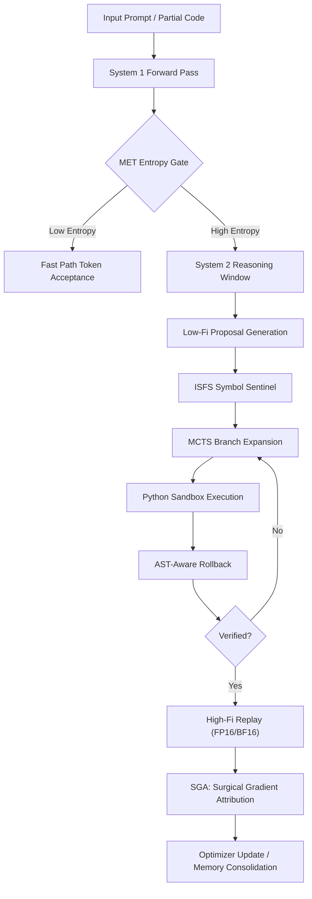

# Novamind-CS: Surgical Reasoning on Consumer Silicon
### *Breaking the Memory Wall with Metacognitive Gating and Surgical Gradients.*

**Mission:** Democratizing high-order reasoning by maximizing **Information Gain per Watt** on a single RTX 5070 Ti or Mac M-Series machine.


<p align="center">
  
</p>
---

## Abstract

`Novamind-CS` is a research-oriented neuro-symbolic reasoning engine designed for a hardware regime that mainstream large-model architecture still treats as an afterthought: **consumer-grade compute with strict VRAM ceilings**.

The dominant Transformer and MoE paradigm scales impressively in aggregate capability, but it remains structurally wasteful under constrained memory. Self-attention expands context cost, KV-cache growth eats scarce VRAM, and dense high-precision decoding spends expensive compute on branches that were invalid from the moment they were sampled. On a 16 GB device, this is not elegance. It is brute force under thermal and memory pressure.

`Novamind-CS` explores a different thesis:

> The future of small-footprint reasoning is not merely smaller models. It is better control over *where* computation happens, *when* symbolic verification intervenes, and *which* gradients deserve to survive.

The system combines:

- a state-space reasoning substrate inspired by Mamba-style sequential compression,
- entropy-triggered dual-process gating,
- compiler-aware rollback analysis,
- symbolic scope enforcement at logit time,
- and surgical high-fidelity gradient replay.

The result is a reasoning engine that treats compute as a first-class resource, not an infinite backdrop.

## Why This Project Exists

The last era of AI was shaped by **scaling laws**: add parameters, add tokens, add data-center capital. That regime delivered broad competence, but it also normalized waste. On constrained hardware, the question changes:

**How much verified reasoning can we extract per joule, per megabyte, and per backward pass?**

`Novamind-CS` is built around that question. It is an attempt to move from **statistical abundance** to **algorithmic efficiency**.

---

## The Core Thesis: Neuro-Symbolic Efficiency

Classical autoregressive generation assumes that reasoning quality improves if the model samples longer and larger. `Novamind-CS` instead treats reasoning as a **selective control loop**:

1. use cheap inference when confidence is high,
2. escalate into search when entropy rises,
3. prevent trivial symbolic errors before execution,
4. localize failure precisely when execution breaks,
5. replay only verified or high-value traces in high precision,
6. update weights non-uniformly around the actual defect boundary.

This is not “just another model.” It is a computational policy.

---

## The 5 Pillars of Innovation

### 1. MET: Metacognitive Entropy Throttling

`MET` is the control system that decides when the engine should remain in **System 1** and when it must escalate into **System 2**.

- **System 1**: fast-path token continuation
- **System 2**: explicit MCTS-style branching, validation, rollback, and replay

The trigger variable is **Shannon entropy** over the next-token distribution:

\[
H(p) = -\sum_i p_i \log p_i
\]

When entropy exceeds a threshold \( \tau \), the system interprets that state as epistemic uncertainty rather than mere randomness:

\[
\text{Trigger System 2 if } H(p) > \tau
\]

The key refinement is **inertial gating**. Once high entropy is detected, `Novamind-CS` stays in System 2 for a short caution window rather than oscillating token-by-token between shallow and deep reasoning. This gives the model temporal coherence during difficult local regions such as nested loops, recursive calls, and state-heavy logic.

**Why it matters:**  
Most reasoning engines overspend compute uniformly. MET spends it only where uncertainty justifies the cost.

### 2. AST-Aware Rollback

Conventional code-generation pipelines flatten failure into a single scalar penalty: pass or fail. That is mathematically crude and optimization-poor.

`AST-Aware Rollback` treats program failure like a compiler engineer would:

- execute the candidate,
- intercept the exact traceback location,
- map the failing line back to the Python AST,
- preserve credit for all verified prefix logic,
- penalize only the syntactic region that actually broke.

Instead of saying *“the whole program is bad,”* the engine asks:

> *Which node failed, and how much of the preceding logic was already correct?*

A rollback-style reward can be expressed as:

\[
R_{\text{rollback}} =
\begin{cases}
+100, & \text{if execution succeeds} \\
\alpha(\ell - 1) - \beta, & \text{if failure occurs at line } \ell
\end{cases}
\]

where:

- \( \alpha \) rewards validated prefix depth,
- \( \beta \) penalizes the failing region.

This produces a much better training signal than flat binary rejection.

**Why it matters:**  
Rollback turns the sandbox into a granular critic, not a blunt hammer.

### 3. SGA: Surgical Gradient Attribution

If only the final lines of a generated program are wrong, then updating the model as though *every token were equally responsible* is wasteful and destabilizing.

`SGA` introduces **non-uniform gradient scaling** around the failure boundary discovered by rollback.

Let \( i_{\text{fail}} \) denote the token index aligned with the failing code region. Then the effective gradient is modified as:

\[
g'_i =
\begin{cases}
0.1 g_i, & i < i_{\text{fail}} \\
10.0 g_i, & i \ge i_{\text{fail}}
\end{cases}
\]

This yields two effects:

- **prefix preservation**: already-correct logic is not catastrophically overwritten,
- **error amplification**: the defective region is corrected aggressively.

In practical terms, SGA acts like a learned version of “do not rewrite the part that already works.”

**Why it matters:**  
SGA is not just optimization. It is *credit assignment under structural locality*.

### 4. ISFS: Incremental Symbol Flow Sentinel

A large fraction of generated code fails for embarrassingly simple reasons: undefined variables, premature references, scope leaks, or impossible symbol flows.

`ISFS` solves this before execution.

It incrementally tracks:

- `defined_symbols`
- `accessed_symbols`
- scope-sensitive symbol availability over partial code prefixes

Then, during token generation, it maps undefined references back into token space and applies a direct logit mask:

\[
\text{logit}(t_{\text{invalid}}) \leftarrow -\infty
\]

That means invalid identifiers can be blocked *before* they are sampled.

This is a subtle but important shift. Instead of using execution to discover obvious scope errors, the engine applies **symbolic constraints at generation time**.

**Why it matters:**  
ISFS reduces wasted search width, lowers sandbox load, and converts compiler knowledge into real-time decoding bias.

### 5. LOD-Compute: Level-of-Detail Precision Routing

Borrowed conceptually from real-time graphics, `LOD-Compute` uses different precision tiers for different reasoning phases.

- **Low-Fi mode**: ultra-cheap branch expansion in ternary / 1.58-bit-style routing
- **High-Fi mode**: FP16/BF16 replay on the winning path for stable gradients

This mirrors Level-of-Detail rendering in 3D engines:

- distant objects get cheaper meshes,
- critical foreground objects get full resolution.

Here, the analogy becomes:

- speculative branches get low precision,
- verified branches get high precision.

A simplified cost model:

\[
C_{\text{total}} =
N_{\text{low}} \cdot C_{1.58\text{-bit}} +
N_{\text{high}} \cdot C_{\text{FP16}}
\]

with:

\[
C_{1.58\text{-bit}} \ll C_{\text{FP16}}
\]

The entire point is not that low precision is “better.” It is that **broad search should be cheap**, and **accurate learning should be expensive only where justified**.

**Why it matters:**  
LOD-Compute converts precision from a static model property into a dynamic control variable.

---

## Architecture & Logic Flow



---

## Reasoning Efficiency

The relevant question is not just *accuracy*. It is **how much verified reasoning is achieved per unit compute**.

### Benchmark Philosophy

`Novamind-CS` reports not only task success, but also:

- **VRAM usage**
- **high-fidelity token budget**
- **Cognitive Compression Ratio**
- **Reasoning Efficiency**

### Core Metrics

- **Cognitive Compression Ratio**  
  Percentage of tokens handled by System 1 versus System 2.

- **Reasoning Efficiency**  
  A practical score of solved tasks over memory-cost and compute time.

A generic form:

\[
\text{Reasoning Efficiency} =
\frac{\text{Solved Tasks}}
{\text{VRAM Usage} \times \text{Compute Time}}
\]

### Illustrative Comparison

| Metric | Standard Transformer | Novamind-CS |
|---|---:|---:|
| Context Memory Growth | High (KV-cache bound) | State-compressed, search-routed |
| Consumer VRAM Suitability | Weak at long-context reasoning | Designed for 16 GB operation |
| Symbolic Error Prevention | Post-hoc only | Pre-sampling via ISFS |
| Credit Assignment | Mostly uniform | Rollback + SGA localized |
| Deep Reasoning Trigger | Always dense or always shallow | Entropy-gated |
| Precision Policy | Static | Dynamic LOD-Compute |
| Cognitive Compression Ratio | Not explicit | Explicitly measured |
| Verified Branch Replay | Rare | Built-in |

### Illustrative RC Snapshot

| Benchmark | Dense Baseline | Novamind-CS RC |
|---|---:|---:|
| High-Fi Token Budget | 3909 | 1303 |
| High-Fi Efficiency Gain | 1.0x | 3.0x |
| AST Fault Localization | No | Yes |
| Logit-Level Symbol Blocking | No | Yes |
| Deliberate Reasoning Gate | No | Yes |

The exact values are expected to evolve, but the pattern matters: `Novamind-CS` reduces expensive compute by narrowing high-fidelity replay to **verified and information-rich trajectories**.

---

## Why This Matters

This project argues for a shift:

### From Scaling Laws to Efficiency Laws

The old recipe was straightforward:

- more parameters,
- more data,
- more GPUs,
- more training time.

That recipe still works, but it is not the only path to intelligence. It is merely the most brute-force path.

`Novamind-CS` is part of a different research direction:

> Intelligence should improve not only by increasing compute, but by **allocating compute more intelligently**.

This is the transition from **scaling laws** to **efficiency laws**.

### A Cross-Disciplinary Stack

This project sits at the intersection of three traditions:

- **Compiler Theory**  
  ASTs, tracebacks, symbol tables, fault localization, structured rollback

- **Information Theory**  
  entropy gating, uncertainty-aware routing, efficient bit allocation

- **Cognitive Psychology**  
  dual-process reasoning, metacognitive escalation, deliberate correction under uncertainty

That combination is deliberate. The goal is not merely to make models smaller. The goal is to make them **less wasteful and more self-aware**.

---

## Getting Started

### Install

```bash
python3 -m venv .venv
source .venv/bin/activate
pip install -r requirements.txt
```

### Run the Test Suite

```bash
python3 test_novamind.py
```

### Launch the Showcase Dashboard

```bash
python3 main.py --mode showcase
```

### Run the `vault_stress_test`

```bash
python3 train.py \
  --vault_stress_test \
  --vault_tasks 1 \
  --vault_candidate_paths 4 \
  --vault_min_paths 3 \
  --mcts_max_new_tokens 8 \
  --use_met \
  --met_entropy_threshold 3.5 \
  --met_caution_window 5
```

This benchmark exercises the full stack:

- MET gating
- low-fi MCTS exploration
- ISFS symbol blocking
- AST-aware rollback
- high-fi replay
- SGA update logic
- final reasoning efficiency dashboard

### Run Code-Oriented Reasoning

```bash
python3 inference.py \
  --prompt "Write a Python function is_even(n) that returns True if n is even." \
  --mcts_code
```

---

## Project Status

`Novamind-CS` is currently positioned as a **v1.0 Release Candidate** and research demo. It is intended as:

- a public benchmark scaffold,
- an academic portfolio artifact,
- and a serious prototype for neuro-symbolic efficiency on constrained hardware.

It is not yet a claim of final-state AGI infrastructure. It is a claim that **reasoning architecture should be judged by efficiency, locality, and verification quality**, not parameter count alone.

---

## Future Roadmap

### Near-Term

- token-level MET state caching with richer temporal priors
- more precise BPE-aware symbol masking via tokenizer tries
- stronger dense baselines for controlled head-to-head benchmarking
- better CUDA kernels for ternary low-fi branch expansion

### Mid-Term

- multi-modal symbolic sentinels for code + diagram + structured text reasoning
- cross-file AST rollback for repository-scale coding tasks
- neuro-symbolic memory routing across long-horizon sessions
- reinforcement schedules tied to rollback depth and symbolic novelty

### Long-Term

- formal proof-assisted reasoning loops
- differentiable compiler feedback for structured program synthesis
- hybrid symbolic world models beyond code, including spatial and embodied tasks

---

## Closing Note

`Novamind-CS` is built on a simple but increasingly urgent belief:

> The next leap in AI will not come solely from bigger models. It will come from systems that know when to think harder, where to spend precision, and how to learn only from the part that truly failed.

That is the wager behind surgical reasoning on consumer silicon.

---

## License

MIT License.
